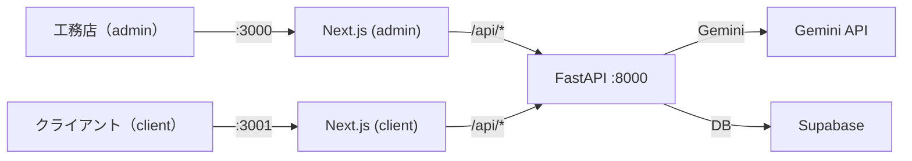

# 🏠 背景・課題
地方の工務店では、少人数での運営ゆえに経営者や職人が直接カスタマーサポート（クレーム対応）を兼任せざるを得ません。
特に、不当な暴言や威圧的な態度をとるクレーマー（カスタマーハラスメント）は、地方の貴重な労働力の精神を削り、廃業にまで追い込む深刻な社会問題となっています。

「技術はあるのに、心がつらくて続けられない」
そんな職人たちを守るための、AIを活用した「心の防波堤」がこのプロダクトです。

# ✨ 主な機能
本プロダクトは、クレーマーと工務店側の間に「AIマスコット」を介在させることで、心理的・実務的負担を軽減します。

## 1. 感情可視化（攻撃性スコア）
- 入力された言葉の「攻撃性」を AI が数値化（0.0〜1.0）します。
- スコアに応じてマスコットがリアクションします（震え/涙など）。

## 2. 毒抜き（工務店が読む内容の整形）
- クライアントの生文を、そのまま工務店に見せない設計です。
- 工務店側には「毒抜き済みのクライアント文」と「工務店（AI）の返信」が表示されます。

## 3. 工務店（AI）返信（MVP）
- まずは MVP として、工務店（AI）の返信を定型文で返します。
- 返信を LLM に置き換えるための接続点は用意済みです（段階的に実装可能）。

# 🛠 テクニカルスタック
AIシステム専攻の知見を活かし、最新のLLMとWeb技術を組み合わせています。

- Frontend: Next.js 16 (App Router), React 19, TypeScript, Tailwind CSS

- Backend: FastAPI (Python) + Uvicorn

- AI Engine: Gemini API（毒抜き + 攻撃性スコア）

- DB: Supabase（customers/messages）

- Animation: CSS Animations（Mascot Reactions）

- Development Tool: Trae IDE

## 画面（ポート分離）
- 工務店ダッシュボード: `http://localhost:3000`（admin専用）
- 工務店チャット（クライアント入力）: `http://localhost:3001`（client専用）

## アーキテクチャ概要

# 🚀 独自の強み (AI Focus)
1. プロンプトエンジニアリング: 単なる要約ではなく、相手の怒りの感情を「数値化（攻撃性スコア）」し、それに応じてUIを動的に変化させるロジック。

2. UXの再定義: 従来の「効率化」のためのAIではなく、人間の「尊厳を守る」ためのAI活用を提案。

# 📸 デモ (予定)
## 🏗️ 開発ロードマップ
- [x] Phase 1: AI APIによる毒抜き + 攻撃性分析エンジンの構築

- [x] Phase 2: マスコットのステート管理とアニメーション実装

- [x] Phase 3: 工務店向けダッシュボード（顧客一覧/履歴）完成
- [ ] Phase 4: 工務店（AI）返信を定型文→LLM生成へ置換
- [ ] Phase 5: 工務店画面の認証（admin専用）と運用分離
