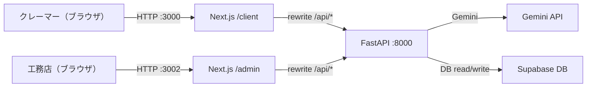
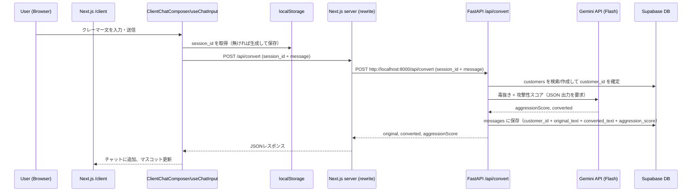
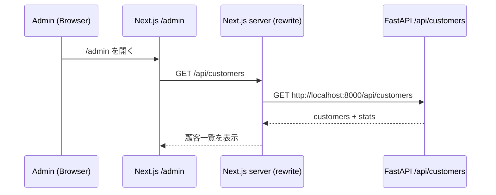
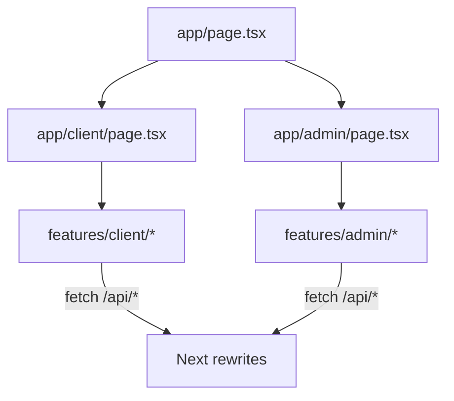
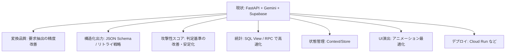

# 実装状況（2026-03-13 時点）

このドキュメントは、現在のリポジトリの実装状態を、構成・接続・技術要素が分かるように整理したものです。

## 全体像（アーキテクチャ）



- フロントエンド: Next.js（App Router）でUIを表示
- クレーマー画面: `/client`（LINE 風チャット + マスコット）
- 工務店画面: `/admin`（顧客一覧 + 顧客詳細/履歴）
- バックエンド: FastAPI（Python）で `/api/*` を提供（Gemini 解析 + Supabase 永続化）
- 接続: フロントからは相対 `/api/*` を呼び、Next.js の `rewrites()` が `http://localhost:8000` に転送

## 画面/データフロー（メッセージ送信）



## 画面/データフロー（工務店：顧客選択）



## ディレクトリツリー（主要部）

※ `node_modules/` や `.next/` 等の生成物は除外して記載。

```text
.
├── AGENT.md
├── README.md
├── package.json
├── package-lock.json
├── .gitignore
├── _docs/
│   ├── アプリケーション全体像.md
│   └── 実装状況.md  ← このファイル
├── backend/
│   ├── main.py
│   ├── requirements.txt
│   ├── .env.example
│   └── src/
│       ├── __init__.py
│       ├── schema.py
│       ├── database.py
│       └── gemini_engine.py
├── frontend/
│   ├── next.config.ts
│   ├── package.json
│   ├── package-lock.json
│   ├── src/
│   │   ├── app/
│   │   │   ├── layout.tsx
│   │   │   ├── page.tsx  （導線）
│   │   │   ├── client/page.tsx
│   │   │   └── admin/page.tsx
│   │   │   ├── globals.css
│   │   │   └── favicon.ico
│   │   ├── features/
│   │   │   ├── chat/
│   │   │   │   ├── components/ChatForm.tsx
│   │   │   │   └── hooks/useChatInput.ts
│   │   │   ├── client/
│   │   │   │   ├── components/ClientChatPage.tsx
│   │   │   │   ├── components/ClientChatTimeline.tsx
│   │   │   │   ├── components/ClientChatComposer.tsx
│   │   │   │   └── hooks/useClientChatState.ts
│   │   │   ├── admin/
│   │   │   │   ├── components/AdminDashboardPage.tsx
│   │   │   │   ├── components/CustomerListPanel.tsx
│   │   │   │   ├── components/CustomerDetailPanel.tsx
│   │   │   │   ├── components/CustomerMessageTimeline.tsx
│   │   │   │   ├── hooks/useCustomers.ts
│   │   │   │   ├── hooks/useCustomerMessages.ts
│   │   │   │   └── types.ts
│   │   │   ├── session/
│   │   │   │   └── hooks/useSessionId.ts
│   │   │   ├── mascot/
│   │   │   │   ├── components/DebugSlider.tsx
│   │   │   │   ├── components/MascotDisplay.tsx
│   │   │   │   └── hooks/useMascotState.ts
│   │   │   └── dashboard/
│   │   │       └── components/MessageList.tsx
│   │   └── types/index.ts
│   └── public/...
└── infrastructure/
    └── README.md
```

## 技術スタック（現状の実装）

### Frontend
- Next.js 16.1.6（Turbopack dev server）: [next.config.ts](file:///Users/ujihara/ハッカソン_2026-3-7/frontend/next.config.ts)
- React 19 / TypeScript
- Tailwind CSS v4（`@import "tailwindcss";`）: [globals.css](file:///Users/ujihara/ハッカソン_2026-3-7/frontend/src/app/globals.css)
- UI補助: `lucide-react`, `clsx`, `tailwind-merge`

### Backend
- FastAPI + Uvicorn（ポート 8000）: [main.py](file:///Users/ujihara/ハッカソン_2026-3-7/backend/main.py)
- Pydantic（入出力スキーマ）: [schema.py](file:///Users/ujihara/ハッカソン_2026-3-7/backend/src/schema.py)
- Gemini 呼び出し: Gemini Developer API（REST, `requests`）: [gemini_engine.py](file:///Users/ujihara/ハッカソン_2026-3-7/backend/src/gemini_engine.py)
- Supabase 永続化: `supabase` SDK（customers/messages/stats）: [database.py](file:///Users/ujihara/ハッカソン_2026-3-7/backend/src/database.py)
- エンドポイント: `POST /api/convert`, `GET /api/messages`, `GET /api/stats/customers`, `GET /api/customers`, `GET /api/customers/{customer_id}/messages`

### Dev Scripts（ルート）
ルートの `package.json` で「ルートで完結」を実現しています: [package.json](file:///Users/ujihara/ハッカソン_2026-3-7/package.json)

- `npm install`
  - `postinstall` により `frontend` の `npm install` を実行
- `npm run dev`
  - `predev` で 3000/3002/8000 のプロセスを掃除（macOS向け）
  - `concurrently` で frontend/backend を同時起動（片方が落ちたら他方も落とす設定）
  - backend 起動は `uvicorn main:app --reload --port 8000`（`.venv` があれば activate を試行）
- `npm run dev:client`
  - クレーマー画面（Next.js :3000）+ backend（:8000）
- `npm run dev:admin`
  - 工務店画面（Next.js :3002）+ backend（:8000）
- `npm run dev:split`
  - クレーマー（:3000）+ 工務店（:3002）+ backend（:8000）を同時起動

## Frontend 実装詳細

### 画面構成
- 導線: [page.tsx](file:///Users/ujihara/ハッカソン_2026-3-7/frontend/src/app/page.tsx)
  - `/client`（クレーマー画面）
  - `/admin`（工務店画面）
- クレーマー画面: [client/page.tsx](file:///Users/ujihara/ハッカソン_2026-3-7/frontend/src/app/client/page.tsx)
  - LINE 風チャット（送信 original / 受信 converted）
  - マスコット表示（スコア連動）
- 工務店画面: [admin/page.tsx](file:///Users/ujihara/ハッカソン_2026-3-7/frontend/src/app/admin/page.tsx)
  - 顧客一覧（ID + 暫定名 + 統計）
  - 顧客詳細（履歴 + 統計）



### 状態管理（現状）
- `/client` は `useClientChatState` が履歴と新規送信を統合して管理
- `/admin` は顧客一覧の選択状態と、選択顧客の履歴をローカル state で管理

### セッション管理（顧客識別）
- ブラウザ単位で `session_id` を生成・保持（localStorage）: [useSessionId.ts](file:///Users/ujihara/ハッカソン_2026-3-7/frontend/src/features/session/hooks/useSessionId.ts)
- `POST /api/convert` の body に `session_id` を同梱: [useChatInput.ts](file:///Users/ujihara/ハッカソン_2026-3-7/frontend/src/features/chat/hooks/useChatInput.ts)

### 履歴表示（DB から取得）
- `/client`: 初期ロードで `GET /api/messages?session_id=...` を呼び、チャット履歴として表示: [useClientChatState.ts](file:///Users/ujihara/ハッカソン_2026-3-7/frontend/src/features/client/hooks/useClientChatState.ts)
- `/admin`: 顧客選択後に `GET /api/customers/{customer_id}/messages` を呼び、履歴として表示: [useCustomerMessages.ts](file:///Users/ujihara/ハッカソン_2026-3-7/frontend/src/features/admin/hooks/useCustomerMessages.ts)

### 型定義
共通型は [types/index.ts](file:///Users/ujihara/ハッカソン_2026-3-7/frontend/src/types/index.ts) に定義。

|型|用途|
|---|---|
|`Message`|original/converted/timestamp/aggressionScore を保持|
|`Customer`|customers の基本情報（現状は型のみ、UI未使用）|
|`CustomerStats`|顧客別統計（平均スコア/件数/最終日時）|
|`AppState`|将来のContext化に備えた形（現状は未使用）|

## Backend 実装詳細（FastAPI + Gemini + Supabase）

### API: POST /api/convert
実装: [main.py](file:///Users/ujihara/ハッカソン_2026-3-7/backend/main.py)

- 入力: `{ "session_id": string, "message": string }`
- 出力: `{ "original": string, "converted": string, "aggressionScore": float }`
- 動作:
  - `session_id` から顧客を識別（customers を検索し、無ければ作成）
  - `GeminiEngine` が Gemini に「毒抜き変換」と「攻撃性スコア算出」を同時に依頼
  - Gemini の返答は JSON（`{ aggressionScore, converted }`）を厳格に要求し、Pydantic で検証
  - `aggressionScore` は 0.0〜1.0 にクランプして UI 整合性を担保
  - 解析結果を messages に保存（`customer_id`, `original_text`, `converted_text`, `aggression_score`）
  - `GEMINI_API_KEY` 未設定の場合は 503 を返して「設定不足」を明示

### API: GET /api/messages
実装: [main.py](file:///Users/ujihara/ハッカソン_2026-3-7/backend/main.py)

- 入力: `session_id`（query）
- 出力: messages の配列（新しい順）
- 動作:
  - `session_id` から `customer_id` を確定し、messages を取得して返す

### API: GET /api/stats/customers
実装: [main.py](file:///Users/ujihara/ハッカソン_2026-3-7/backend/main.py)

- 出力: 顧客別統計（`avgAggressionScore`, `messageCount`, `lastMessageAt`）
- 動作:
  - MVP として messages を取得し、Python 側で集計して返す: [database.py](file:///Users/ujihara/ハッカソン_2026-3-7/backend/src/database.py)

### API: GET /api/customers
実装: [main.py](file:///Users/ujihara/ハッカソン_2026-3-7/backend/main.py)

- 出力: 顧客一覧（`customerId`, `displayName`, `avgAggressionScore`, `messageCount`, `lastMessageAt`, `createdAt`）
- 動作:
  - customers 一覧と messages 統計を合成して返す: [database.py](file:///Users/ujihara/ハッカソン_2026-3-7/backend/src/database.py)

### API: GET /api/customers/{customer_id}/messages
実装: [main.py](file:///Users/ujihara/ハッカソン_2026-3-7/backend/main.py)

- 出力: 指定顧客の messages 配列（新しい順）
- 動作:
  - `customer_id` で messages を取得して返す: [database.py](file:///Users/ujihara/ハッカソン_2026-3-7/backend/src/database.py)

### 環境変数
- `backend/.env`（ローカル用、Git 管理外）
  - `GEMINI_API_KEY`: Google AI Studio の API キー
  - `GEMINI_MODEL`: 使用モデル（未指定時はデフォルト）
  - `SUPABASE_URL`: Supabase プロジェクト URL
  - `SUPABASE_ANON_KEY`: Supabase anon key
- サンプル: [backend/.env.example](file:///Users/ujihara/ハッカソン_2026-3-7/backend/.env.example)

### 使用モデル（現状）
- デフォルト: `models/gemini-flash-latest`
- 環境変数 `GEMINI_MODEL` で上書き可能
- 実装: [GeminiEngine](file:///Users/ujihara/ハッカソン_2026-3-7/backend/src/gemini_engine.py)

#### モデル名に関する注意
- キー/プロジェクトによって利用可能なモデル名が異なり、存在しないモデル名を指定すると `/api/convert` が 500 になります（Gemini 側が 404 を返す）。
- その場合は `GEMINI_MODEL` を `models/gemini-flash-latest` など「ListModels で確認できる名前」に変更します。
- 参考: `models/gemini-2.5-flash` / `models/gemini-2.0-flash` / `models/gemini-3-flash-preview` などが見える環境があります（利用可否はアカウント/リージョン/ティアに依存）。

## Frontend ↔ Backend の接続状況

### 現状の接続方式（推奨）
- フロントの fetch は相対パス `/api/*` を使用（`/api/convert`, `/api/messages` など）
  - 送信: [useChatInput.ts](file:///Users/ujihara/ハッカソン_2026-3-7/frontend/src/features/chat/hooks/useChatInput.ts)
  - 履歴: [MessageList.tsx](file:///Users/ujihara/ハッカソン_2026-3-7/frontend/src/features/dashboard/components/MessageList.tsx)
- Next.js 側が `rewrites()` でバックエンドへ転送: [next.config.ts](file:///Users/ujihara/ハッカソン_2026-3-7/frontend/next.config.ts)

この方式のメリット:
- ブラウザが `localhost:8000` に直接アクセスしないため、環境差分（CORS/ネットワーク制約）に強い

## 運用上の注意 / 既知の課題

### 1) Turbopack の「複数 lockfile」警告
ルートと `frontend/` の両方に `package-lock.json` が存在するため、Next.js がワークスペースのルート推測で警告を出すことがあります。
- 現状は警告のみで動作するが、将来的には `turbopack.root` 設定で明示する選択肢があります。

### 2) `frontend/src/features/mascot/components/MascotDisplay.tsx` の震え実装
現在、震え表現は CSS アニメーションで実装しています（レンダー中に `Math.random()` を呼ばない）:
- 実装: [MascotDisplay.tsx](file:///Users/ujihara/ハッカソン_2026-3-7/frontend/src/features/mascot/components/MascotDisplay.tsx)
- アニメーション定義: [globals.css](file:///Users/ujihara/ハッカソン_2026-3-7/frontend/src/app/globals.css)

### 3) README と実装の差分
ビジョン資料: [_docs/アプリケーション全体像.md](file:///Users/ujihara/ハッカソン_2026-3-7/_docs/アプリケーション全体像.md) は、Next.js API Routes / Gemini 等の構想が含まれています。
一方、現状は以下です。
- Backend: Next.js API Routes ではなく **FastAPI（Python）**
- AI: **Gemini API を接続済み**（Flash 系モデル、JSON で出力）
- DB: **Supabase を接続済み**（顧客識別/履歴/統計）

README は FastAPI/8000 に合わせて更新済み: [README.md](file:///Users/ujihara/ハッカソン_2026-3-7/README.md)

## 次の実装候補（ロードマップ案）


